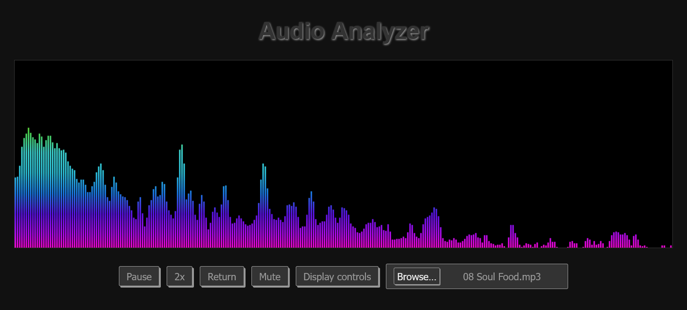

# audio_analyser

 audio analyser 

In order to be able to retrieve the output directly from the sound card, i.e. not via the microphone, a setting must be made. For Realtek: "Stereo mix" must be set for "Recording" in the sound settings. Otherwise it will only work via the microphone.

createAnalyser :

https://developer.mozilla.org/en-US/docs/Web/API/BaseAudioContext/createAnalyser

getByteFrequencyData :

https://developer.mozilla.org/en-US/docs/Web/API/AnalyserNode/getByteFrequencyData

getUserMedia :

https://developer.mozilla.org/en-US/docs/Web/API/MediaDevices/getUserMedia

createMediaStreamSource : 

https://developer.mozilla.org/en-US/docs/Web/API/AudioContext/createMediaStreamSource

Preview:

